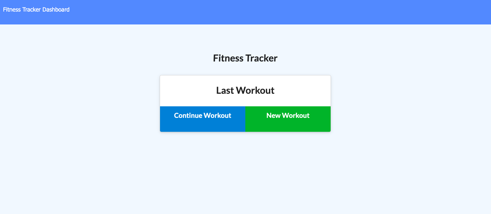

# Workout-Tracker

Github Code: https://github.com/RimaOdolski/Workout-Tracker

Heroku Website: https://tranquil-eyrie-53279.herokuapp.com/

# Description 

This a workout tracking app. When the user loads the page, they should be given the option to create a new workout, or continue with their last workout.

The user should be able to:

  * Add exercises to a previous workout plan.

  * Add new exercises to a new workout plan.

  * View multiple the combined weight of multiple exercises on the `stats` page.

  # Installation 
  To install necessary dependencies, run the following command:
  ```
  npm i
  ```

  # Tests
  ```
  node server.js
  ```

   